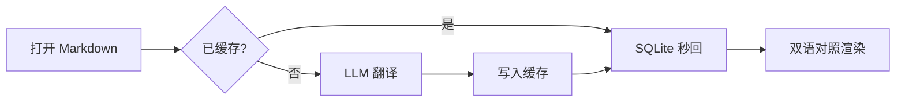

# Preview Sample Document

This sample exercises the renderer and the **LLM translation** pipeline. Open the settings window (⌘,) to configure an OpenAI-compatible endpoint, then switch the toolbar mode to "双语对照".

## Why segment-level caching?

Each top-level block is translated independently and cached by `sha256(model | language | source)`. Edit any paragraph and only that paragraph is re-translated — everything else returns instantly from SQLite.

> Blockquotes, *emphasis*, `inline code`, and [reference links][tauri] are preserved by the translation prompt.

## Code stays untouched

```rust
fn main() {
    println!("code blocks are never sent to the LLM");
}
```

## Mermaid diagrams



## Feature checklist

- [x] Markdown rendering (tables, footnotes, task lists)
- [x] Bilingual side-by-side mode
- [ ] PDF preview (see ROADMAP M3)

| Format | Status |
| ------ | ------ |
| Markdown | ✅ |
| Image | ✅ |
| PDF | 🚧 |

---

Footnotes work too[^note].

[^note]: This is a footnote definition.

[tauri]: https://tauri.app "Tauri"
